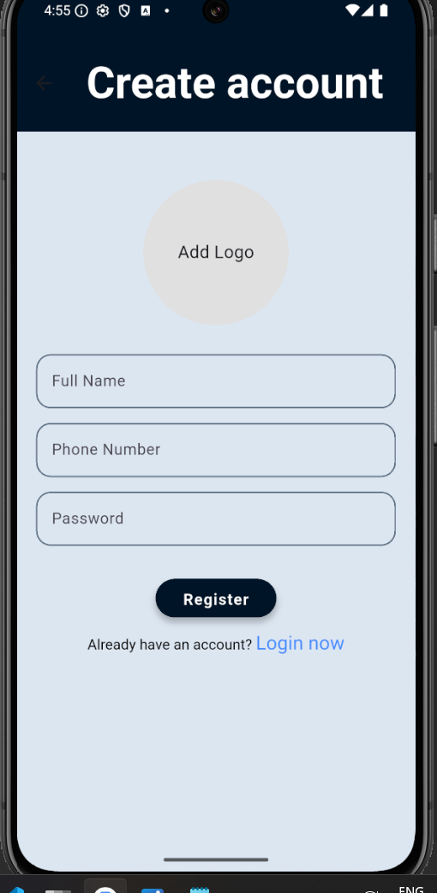
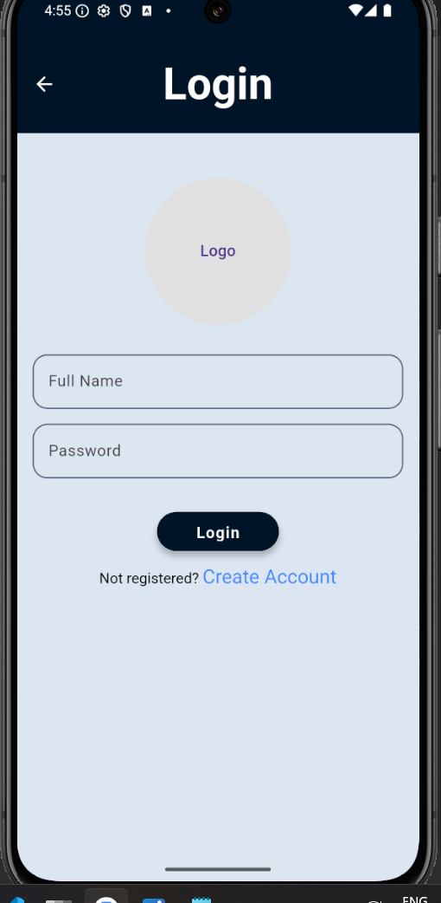
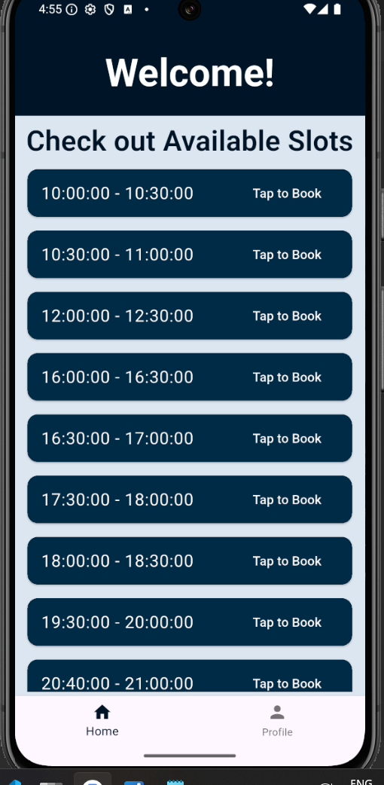
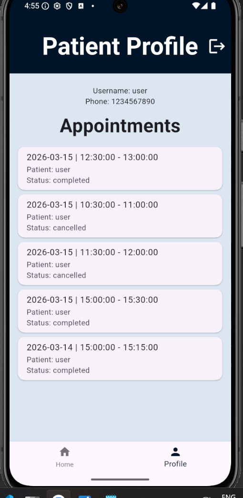
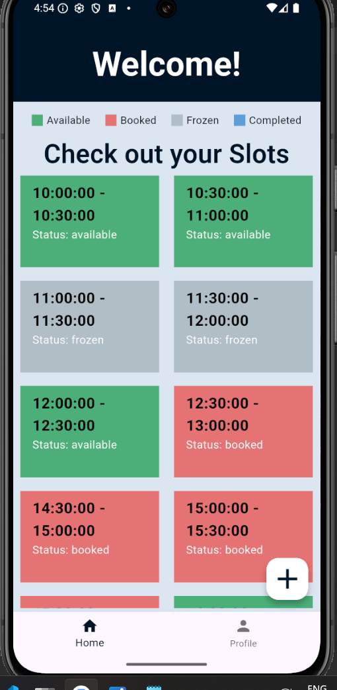
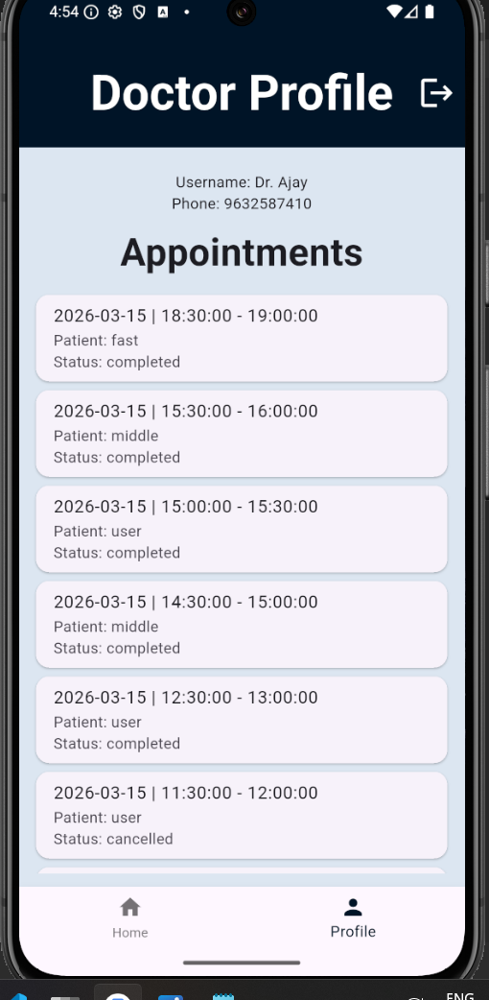

# DocAppoint - Frontend

A full-stack Doctor Appointment Booking System built using Flutter and FastAPI that allows patients to book time slots with doctors and enables doctors to manage and complete appointments.

## Tech Stack
- Flutter
- Dart
- Rest API
- JWT Authentication
  
## Features
Patient:
- Register and Login
- View available slots
- Book an appointment
- Cancel an appointment
- View appointment history

Doctor:
- Login
- Generate appointment slots
- View all slots
- Freeze/unfreeze slots
- See patient details
- Mark appointment as completed

## Screens
- Register
- Login
- Patient Home 
- Doctor Dashboard
- Profile & Appoinments

## Installation

Clone repository:
git clone https://github.com/codingPurnima/doc_appoint_frontend.git

Install dependencies:
flutter pub get

Run the app:
flutter run

Make sure the backend server is running before starting the app

## Backend Repository
Backend API is available here:

https://github.com/codingPurnima/doc_appoint_backend.git

## Screenshots

### Register

### Login

### Patient Home

### Patient Profile

### Doctor Home

### Doctor Profile

